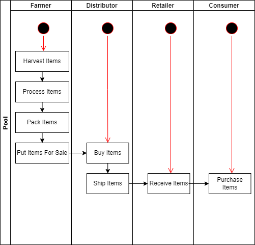
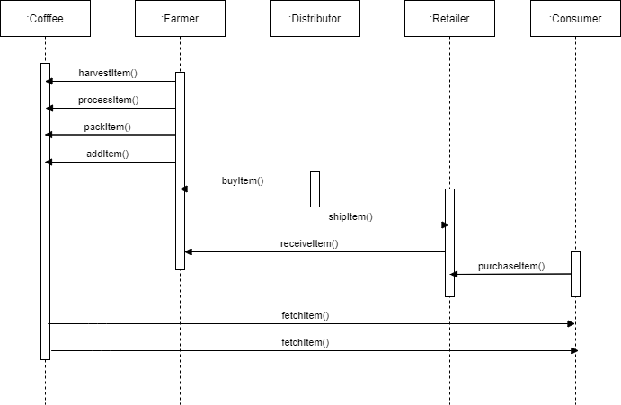
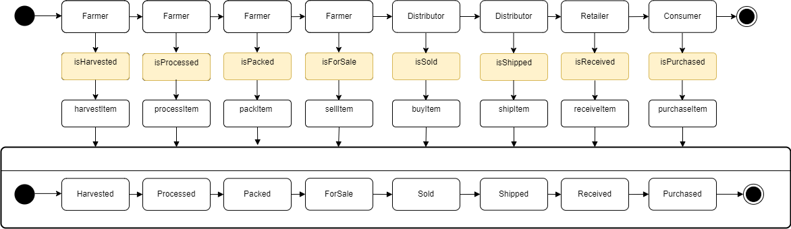
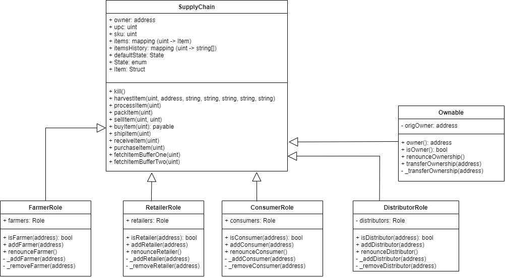

# Project Write-Ups

## UML Digrams

#### Activity Digram

#### Sequence Digram

#### State Digram

#### Classes (Data model)

## Project write-up - Libraries
- node: v16.14.0
- npm: 8.5.2
- truffle: v4.1.14
- truffle-hdwallet-provider: 1.0.17
## Project write-up - IPFS 
- This project doesn't use IPFS
## General Write Up
- **Step 1:** Clone boilerplate project and run in local environment
- **Step 2:** Analysis and create UML Diagrams
- **Step 3:** Write smart contracts
- **Step 4:** Write test cases and run in local environment
- **Step 5:** Run front-end project to interact with blockchain (local environment)
- **Step 6:** Deploy smart contract on a public test network (Rinkeby) and retest with front-end application

# Deploy smart contract on a public test network (Rinkeby)
- Transaction ID: https://rinkeby.etherscan.io/tx/0x6ac727ea7a7dd0d31882a466b85835224f496132394943b42b4884bc2ac2b9d6
- Contract Address: 0x79e2a6ef4ac58f82e62721a4ffd74cf26c699086
